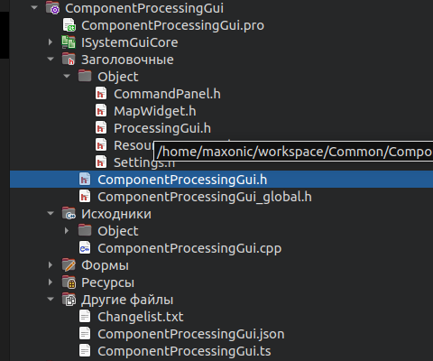
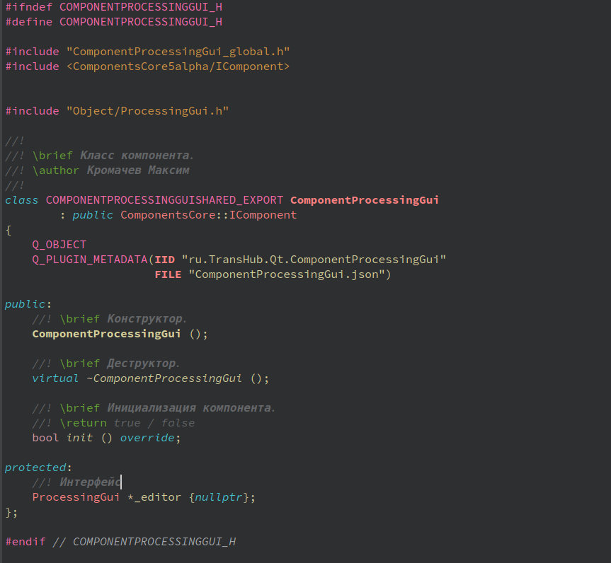
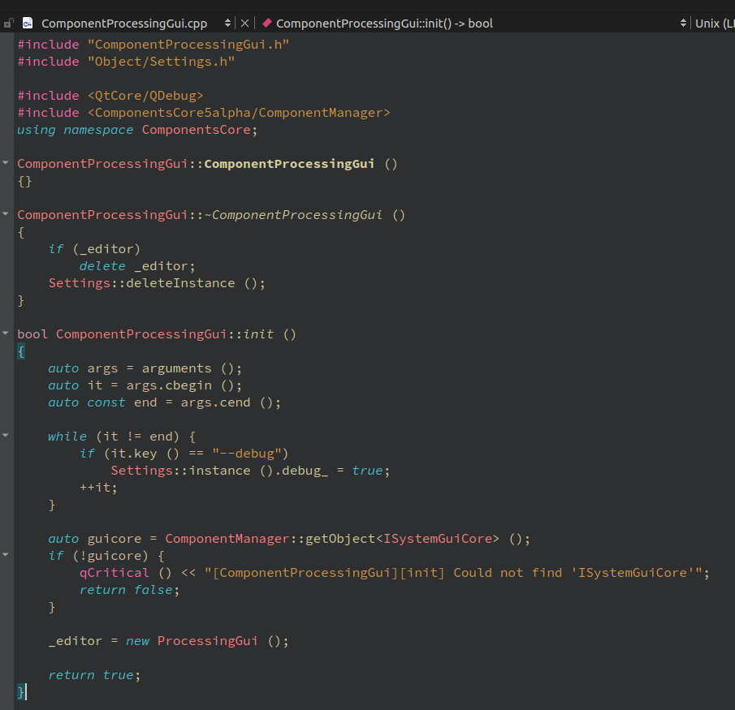
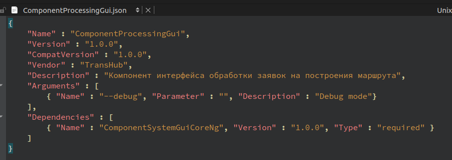

## About

Файл описывающий структуру программного модуля приложения(динамической библиотеки .so).

## Instruction

**Файл .pro проекта:**

Для начала создайте .pro файл, который будет описывать структуру вашего модуля. Укажите, что модуль является динамической библиотекой(TEMPLATE = lib). Для того, чтобы при сборке библиотеки создавался один файл .so нужно добавить в .pro файл строку: CONFIG += plugin. Далее задайте имя вашей библиотеки: TARGET = $$qtLibraryTarget(NameOfLibrary).
Далее все зависимости указываются по классики.

# Далее по структуру проекта:

***Cтруктура папки проекта:***

Папка должна содержать файы .h, .cpp и .json, совпадающие с названием библиотеки(папки проекта). Эти файлы являются основными и обязательными. Далее описание каждого из этих трех файлов.

    

***Структура основного .hpp файла библиотеки:***

Файл должен наследоваться от интерфейсного класса IComponent, так как все объекты наследующиеся от этого класса в дальнейшем должны быть добавлены в менеджер компонент. Также в файле должен быть определен макрос метаинформации(Q_PLUGIN_METADATA(IID "ru.TransHub.Qt.ComponentProcessingGui" FILE "ComponentProcessingGui.json")), который ссылается на .json файл c информацией о библиотеке. В теле класса должен быть определен метод init(), описание которого будет ниже.

    

***Структура основного .cpp файла библиотеки:***

Внутри функции init() вызывается метод addObject() класса IComponent, который добавляет объект вашего класса в менеджер(на картинке его нет)

    

***Структура .json файла библиотеки:***

Структура должна быть такой же, единственное нужно уточнить про состояния зависимостей:
- Required,   //!< Обязательная
- Optional,   //!< Не обязательная
- Exclude     //!< Взаимоисключающий

    

## Authors

- [Kromachev Maxim](https://github.com/kromachmax)
